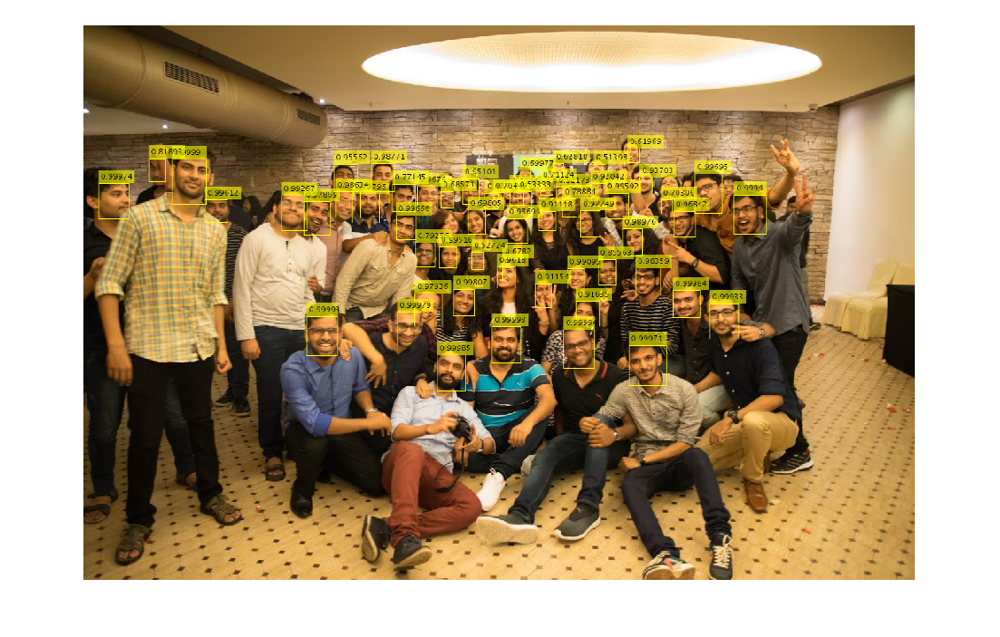
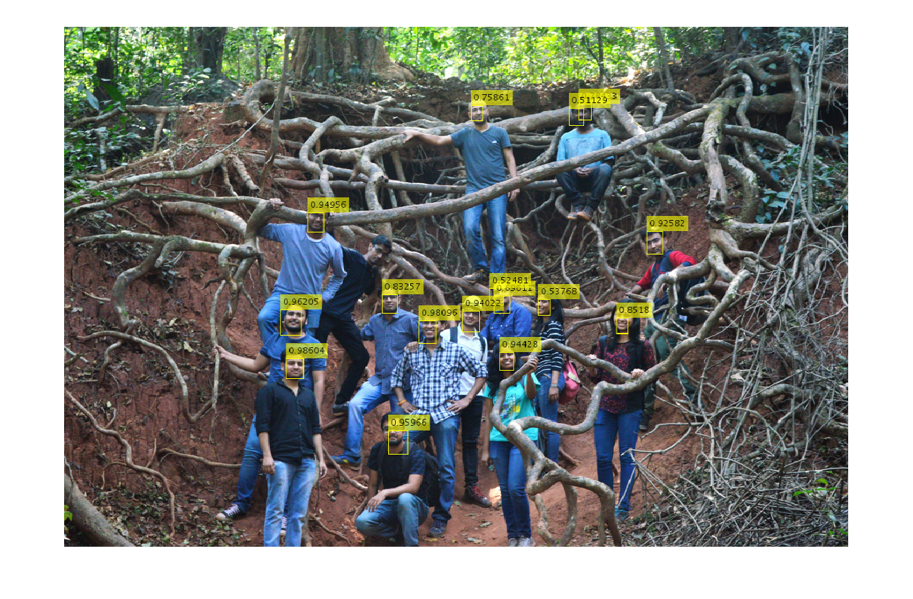
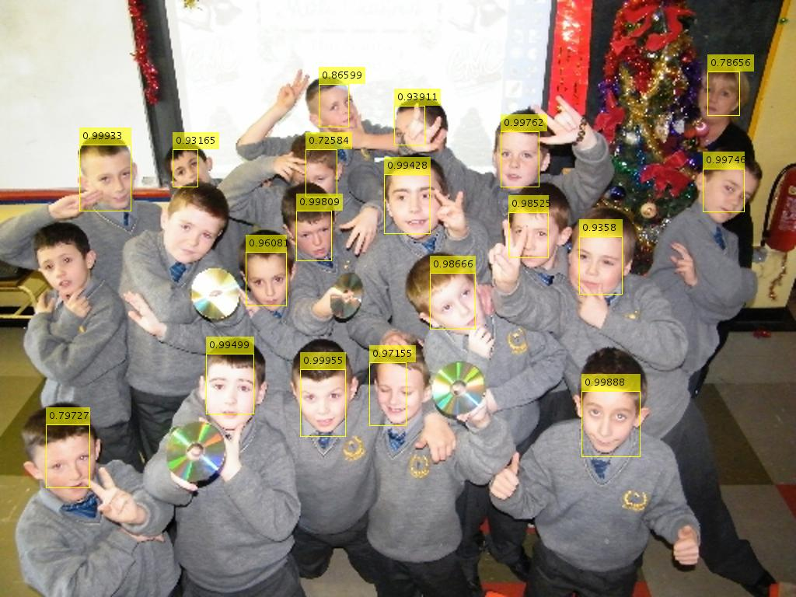
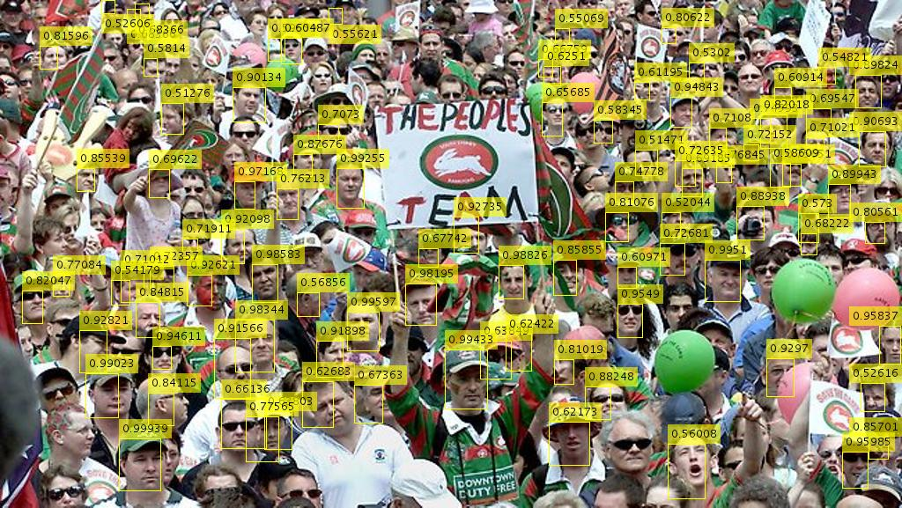

# Face-Recognition-using-Faster-R-CNN
Face Recognition using Faster R-CNN

## Abstract
Face detection has vast applications in the areas ranging from surveillance, security, crowd size estimation to social networking etc. The challenge lies in creating a model which is agnostic to lightning conditions, pose, accessories and occlusion. We aim to create a pipeline which takes an image as an input and creates a bounding box on the faces of all the people in the image. 

## Dependencies
- Matlab 2018
  - [Neural Network Toolbox](https://www.mathworks.com/products/neural-network.html)
  - [AlexNet](https://www.mathworks.com/help/nnet/ref/alexnet.html)
  - [VGG16](https://www.mathworks.com/help/nnet/ref/vgg16.html)

## Instructions for running the code
- Training and testing WIDER dataset on VGG16
  - Run face-recognition/Train_2_1_TL.m
- Training and testing FDDB dataset on VGG16
  - Run face-recognition/Ayush_Train_VGG_FDDB.m
  
## Overall Details
- We used following dataset:
  - WIDER
    -32,203 images and label 393,703 faces with a high degree of variability in scale, pose and occlusion as depicted in the sample images.WIDER FACE dataset is organized based on 61 event classes. For each event class, we randomly select 40%/10%/50% data as training, validation and testing sets.
  - FDDB
   - This data set contains the annotations for 5171 faces in a set of 2845 images.
  - Some of our own images

- We Train our dataset on following model:
  - Alexnet
  - VGG16
  - Made our own model on 11 layers

- We had following constraints:
  - Due to lack of gpu we have to reduce size of our images.
  example: WIDER images had (1200X1500) approx size. We have to reduce size of the image to (600X(600*rescaleFactor)).
  - Due to reduction in size of images some of the faces which were almost not visible (as small as a dot). Detector ignored these faces.
  - This reduced the accuracy of the model. Otherwise it would have shown overall better accuracy.
  - Traing process was time consuming because of lack of resources.

- Training and Testing Data
  - FDDB on VGG16
    - Trained Data - 60%
    - Test Data - 40%
    - MAP estimate - 87%
  - WIDER on VGG16
    - Trained Data With reduced Dimension of images- 40%
    - Test Data on- 50%
    - MAP estimate - 35% to 40% (with many of the faces getting ignored due to reduced dimension)
  - WIDER on our own model(13 layers)
    - Train data - 1000 images
    - Testing data - 300 images
    - MAP estimate - 35%

- Important points
  - WIDER and FDDB on Alexnet doesn't work very well
  - WIDER and FDDB on VGG16 worked very well
  - We tested VGG16 model trained on WIDER and tested ON FDDB. IT gave 82% accuracy.
  - On our own model with 11 layers training took lot of time.
  - We tested our own images on VGG16 trained over WIDER network and it worked really well!

 

## Results
- 
- 
- 
- 
